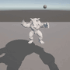
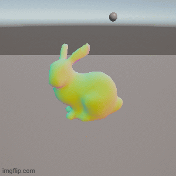
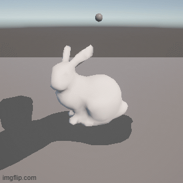

# Task04: Unity Shader Practice 1 (Shadow by Vertex Shader)

**Deadline: May 26 (Tue) at 15:00pm**

----

## Before Doing Assignment

If you have not installed Unity on your computer, please install. 

---

## Problem 1

Do the following procedure:

### Create Project
- In the `UnityHub`, make a new Unity project named `task04` under `acg-<username>/task04` using the `Universal 3D` template.
- You will see project related folders like `acg-<username>/task04/task04/Assets`.

### Set Camera
- Set the `Position` of the `Main Camera` to `(0, 0.8, -2)`.
- Set the `Rotation` of the `Main Camera` to `(25, 0, 0)`
- Keep the other parameters default (Field of View is `60`).

### Set Light
- Click the `Directional Light` in the `Hierarchy` window (left-top). In the `Inspector` window, set `Shadows > Shadow Type` as `No Shadows`. 

### Import Mesh
- Import the `acg-<username>/task04/armadillo.obj` to the asset by dragging it into the `Assets` window (bottom).
- Import the `armadillo` Prefab to the scene by dragging `armadillo` in the `Assets` window (bottom) to the `Hierarchy` window (top-left).
- In the `Hierarchy`window, click `default` GameObject under the `armadillo` prefab.
- Set the position of the `armadillo` to `(0, 0, 0)`. Make sure `armadillo > default`'s position is `(0, 0, 0)`. 

### Import Shader and Set Material to the Mesh
- Drag the `acg-<username>/task04/Shadow0.shader` to the `Assets` window.
- Make a new material by selecting the right click menu in the `Assets` window (bottom) `Create > Rendering > Material`.
- Name the new material as `Shadow0`
- Click the `New Material` in the `Asssets` window (bottom) to show `Inspector`window (right). Set the `Shader` pull down menu to `Custom/Shadow0`.
- Drag the `New Material` to the `armadillo > default` in the `Hiearchy` window (left).

### Create Plane
- Add a 3D plane by left click menu in the `Hiearchy` window (top-left), `3D Object` > `Plane`.
- Make sure the position of the plane at `(0, -0.8, 0)`
- Keep the other parameters default (e.g., scale is `(1., 1., 1.)`)

### Create Sphere
- Add a 3D plane by left click menu in the `Hiearchy` window (top-left), `3D Object` > `Sphere`.
- Set the position of the sphere at `(0, 0.8, 0)`, scale as `(0.1, 0.1, 0.1)`
- Drag the `acg-<username>/task04/CircleMotion.cs` to the `Assets` window.
- Apply the script `CircleMotion.cs` to the `Sphere` object by dragging the script from the `Asset` window to the `Sphere` game object in the `Hierarchy` window.
- Open the `Inspector` window of the `Sphere` game object and find `Circle Motion` script. Set the `Target Material` to `Shadow0` by dragging the `Shadow0` material to the textbox. 
- Open the `CircleMotion.cs` and observe how the sphere position is passed to the `Shadow0` shader.

### Take a screenshot
- Set the window resolution to 300x300. 
- Set up the ｀Recoder｀ package for screenshot image (see the [Lecture Material about Unity](http://nobuyuki-umetani.com/acg2026s/26_unity.pdf))
- Capture the screen from 0th to 30th frame.
- Rename the screenshot image and place it as `acg-<username>/task04/problem1.gif`

## Problem 2

### Modify the Shader 
- Edit `acg-<username>/task04/task04/Assets/Shadow0.shader` such that the vertex is casted on the plane along the line connecting the vertex and the sphere position. Make the output color RGB as `(0.1, 0.1, 0.1)` to make the shadow dark.

### Import Mesh Again
- We need to put the mesh again to show the object that cast shadow.
- Import the `acg-<username>/task04/armadillo.obj` to the asset by dragging it into the `Assets` window (bottom).
- Import the `armadillo` Prefab to the scene by dragging `armadillo` in the `Assets` window (bottom) to the `Hierarchy` window (top-left).
- In the `Hierarchy`window, click `default` GameObject under the `armadillo` prefab.
- Set the position of the `armadillo` to `(0, 0, 0)`. Make sure `armadillo > default`'s position is `(0, 0, 0)`. 

### Take a screenshot
- Set the window resolution to 300x300.
- Set up the `Recorder` package for screenshot video (see the [Lecture Material about Unity](http://nobuyuki-umetani.com/acg2026s/26_unity.pdf))
- Capture the screen from 0th to 30th frame.
- Rename the screenshot image and place it as `acg-<username>/task04/problem2.gif`

## After Doing the Assignment

After modifying the code, push the code and submit a pull request.

Please include all the Unity project files (not only edited `Shadow0.shader`). The binary intermediate files should be excluded automatically from commit (see the `acg-<username>/.gitignore`). 

Make sure the commit include `problem1.gif` and `problem2.gif`.

## Notes
- The lecture do not explain detail of Unity and C#. Find your self on the internet or using chat AI (e.g., ChatGPT). 
- Do not submit multiple pull requests. Only the first pull request is graded
- Do not close the pull request by yourself. The instructor will close the pull request
- If you mistakenly merge the pull request, it's OK, but be careful not to merge next time. 
