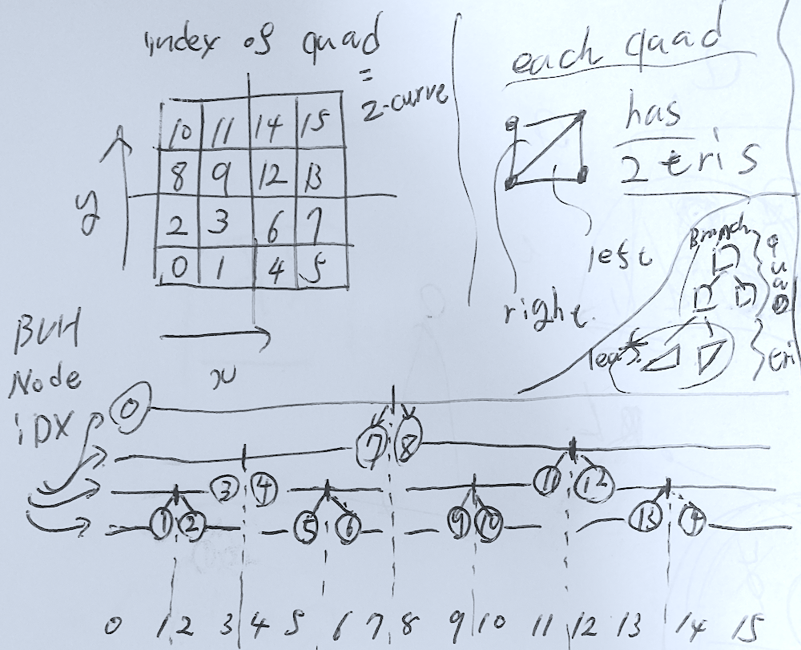

# Task05: Raycasting Practice (Bounding Box Hierarchy, Tile-based Acceleration)

**Deadline: May. 29th (Fri) at 15:00pm**

This is the blurred preview of the expected result:


----

## Before doing the assignment

Follow the instruction same as `task01` and `task02` to submit the assignment. In a nutshell, before doing the assignment,
- make sure you synchronized the main  branch of your local repository to that of remote repository.
- make sure you created branch `task05` from main branch.
- make sure you are currently in the `task05` branch (use git branch -a command).

The command will be like below

```bash
$ cd acg-<username>  # go to the local repository
$ git checkout main  # set main branch as the current branch
$ git fetch origin main    # download the main branch from remote repository
$ git reset --hard origin/main  # reset the local main branch same as remote repository
$ git branch -a   # make sure you are in main branch
$ git branch task05   # create task05 branch from main branch
$ git checkout task05  # switch into the task05 branch
$ git branch -a   # make sure you are in the task05 branch
```

Now you are ready to go!


Compile the code with

``` bash
$ cd task05  # you are in "acg-<username>/task05" directory
$ cargo run --release # configure Release mode for fast execution
```

This program output `output1.png` and `output2.png`, but currently the program is slow.


### Problem 1


This code compute the intersection between triangle mesh and the primary ray (i.e., ray from camera) and render the result as a normal image.
Currently, the rendering is slow because of the brute force computation.
In the `build_bvh` function, implement the code to construct bounding volume hierarchy as the image below.



Note the underlying structure of the mesh is quad mesh where quads are indexed as image above.
Take advantage of this indexing when constructing BVH (do not count leading zero implicitly or explicitly).
Write a simplest construction code specific to this mesh.

Switch to the BVH computation mode by comment in/out around `line #29` in the `problem1` function in the `problem1.rs`.  

Write the computation time w/ and w/o BVH below. 

| bruteforce (sec) | with BVH (sec) |
|------------------|----------------|
| ???              | ???            |

Write the key value that is printed below (this makes grading easier).

| key |
|-----|
| ??? |

Read the `From Morton Code to BVH Tree` page in the `Ray Triangle Collision` slide.


### Problem 2

Let's ray-cast a triangle mesh efficiently by tile-based acceleration
In the `build_tile2idx_idx2tri` function, implement the code to compute `jagged array`, which store the map from tile to triangle.
Follow the procedure in `Jagged Array` slide's `Construction of Jagged Array` page for your implementation.

The current jagged array is for brute force computation and it's very inefficient. Comment out the current implementation.

Fill in the table below. 

| Tile_size | Rendering time | Avg number of tris in a tile |
|-----------|----------------|------------------------------|
| 1         | ???            | ???                          |
| 2         | ???            | ???                          |
| 4         | ???            | ???                          |
| 8         | ???            | ???                          |
| 16        | ???            | ???                          |
| 32        | ???            | ???                          |
| 64        | ???            | ???                          |
| 128       | ???            | ???                          |
| 256       | ???            | ???                          |
| 512       | ???            | ???                          |


### Submit

Before submitting a pull request, neat up the code by fixing the problem pointed out by linter.
```bash
cargo clippy
```

Make your code formated by the following command

```bash
cargo fmt
```

Finally, you submit the document by pushing to the `task05` branch of the remote repository. 

```bash
cd acg-<username>    # go to the top of the repository
git status  # check the changes
git add .   # stage the changes
git status  # check the staged changes
git commit -m "task05 finished"   # the comment can be anything
git push --set-upstream origin task05 # up date the task05 branch of the remote repository
```

got to the GitHub webpage `https://github.com/ACG-2026S/acg-<username>`. If everything looks good on this page, make a pull request. 


## Reference

- [Thinking Parallel, Part III: Tree Construction on the GPU](https://developer.nvidia.com/blog/thinking-parallel-part-iii-tree-construction-gpu/)
- [24 - Bounding Volume Hierarchies with a blazing fast implementation using Morton codes @ Ten Minute Physics](https://www.youtube.com/watch?v=LAxHQZ8RjQ4)
- [Rendering Lecture 1 - Spatial Acceleration Structures @ 
Computer Graphics at TU Wien](https://www.youtube.com/watch?v=MzUxOe5x24w)
- [Ray Tracing with Bounding Volume Hierarchies @ The Graphics Guy](https://www.youtube.com/watch?v=BmbfjHoqKUs)
