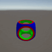
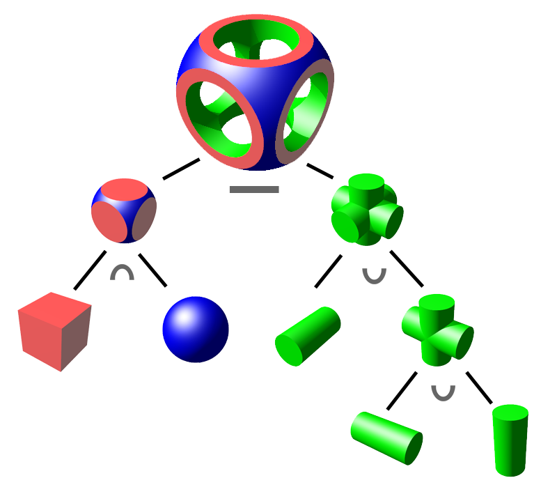

# Task06: Unity Shader Practice 2 (Implicit Modeling using Fragment Shader)

**Deadline: Jun 12 (Fri) at 15:00pm**

----

## Before Doing Assignment

If you have not installed Unity on your computer, please install. 

---

## Problem 1

Do the following procedure:

### Create Project
- In the `UnityHub`, make a new Unity project named `task06` under `acg-<username>/task06` using the `Universal 3D` template.
- You will see project related folders like `acg-<username>/task06/task06/Assets`.

### Set Camera
- Set the `Position` of the `Main Camera` to `(0.0f, 1.5f, -3.0f`.
- Set the `Rotation` of the `Main Camera` to `(22, 0, 0)`
- Keep the other parameters default (Field of View is `60`).
- Drag the `acg-<username>/task06/CameraMove.cs` to the `Assets` window.
- Apply the script `CameraMove.cs` to the `Main Camera` object by dragging the script from the `Asset` window to the `Main Camera` game object in the `Hierarchy` window.
- Make sure camera is moving by hitting the `Play` button.

### Create Plane
- Add a 3D plane by left click menu in the `Hiearchy` window (top-left), `3D Object` > `Plane`.
- Make sure the position of the plane at `(0, 0, 0)`
- Set the rotation as `(-90,0,0)`
- Keep the other parameters default (e.g., scale is `(1., 1., 1.)`)

### Import Shader and Set Material to the Mesh
- Drag the `acg-<username>/task06/RayMarching.shader` to the `Assets` window.
- Make a new material by selecting the right click menu in the `Assets` window (bottom) `Create > Rendering > Material`.
- Name the new material as `New Material`
- Click the `New Material` in the `Asssets` window (bottom) to show `Inspector`window (right). Set the `Shader` pull down menu to `Custom/RayMarching`.
- Drag the `New Material` to the `Plane` in the `Hiearchy` window (left).

### Take a screenshot
- Set the window resolution to 300x300. 
- Set up the ｀Recoder｀ package for screenshot image (see the [Lecture Material about Unity](http://nobuyuki-umetani.com/acg2026s/26_unity.pdf))
- Capture the screen from 0th to 30th frame.
- Rename the screenshot image and place it as `acg-<username>/task06/problem1.gif`

What actually you see is a image pasted on the `Plane` where is background is transparent. See the `Plane` from side angle in the `Scene` window to confirm it. 

Your following tasks are to perform CSG operation (union, intersection, difference) as the following image.

Figure 1. The target CSG operation.

## Problem 2

### Modify the Shader 
- Edit `acg-<username>/task06/task06/Assets/RayMarching.shader` to define the signed distance function resulting from the CSG operation in Figure 1 (The resulting object should be colored in green).

### Take a screenshot
- Set the window resolution to 300x300.
- Set up the `Recorder` package for screenshot video (see the [Lecture Material about Unity](http://nobuyuki-umetani.com/acg2026s/26_unity.pdf))
- Capture the screen from 0th to 30th frame.
- Rename the screenshot image and place it as `acg-<username>/task06/problem2.gif`

## Problem 3

### Modify the Shader 
- Edit `acg-<username>/task06/task06/Assets/RayMarching.shader` to paint the object such that it looks similar to the coloring in Figure 1.

### Take a screenshot
- Set the window resolution to 300x300.
- Set up the `Recorder` package for screenshot video (see the [Lecture Material about Unity](http://nobuyuki-umetani.com/acg2026s/26_unity.pdf))
- Capture the screen from 0th to 30th frame.
- Rename the screenshot image and place it as `acg-<username>/task06/problem3.gif`

## After Doing the Assignment

After modifying the code, push the code and submit a pull request.

Please include all the Unity project files (not only edited `Shadow0.shader`). The binary intermediate files should be excluded automatically from commit (see the `acg-<username>/.gitignore`). 

Make sure the commit include `problem1.gif` and `problem2.gif`.

## Notes
- The lecture do not explain detail of Unity and C#. Find your self on the internet or using chat AI (e.g., ChatGPT). 
- Do not submit multiple pull requests. Only the first pull request is graded
- Do not close the pull request by yourself. The instructor will close the pull request
- If you mistakenly merge the pull request, it's OK, but be careful not to merge next time. 
