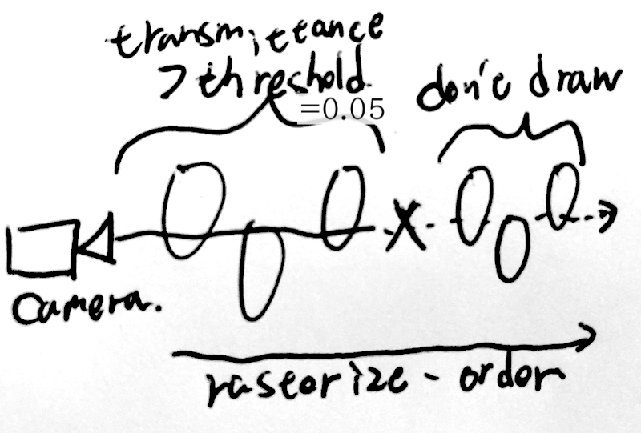

# Task07: Gaussian Splatting (Transparency, Alpha-blending)

**Deadline: Jun. 19th (Fri) at 15:00pm**

This is the blurred preview of the expected result:


----

## Before doing the assignment

Follow the instruction same as `task01` and `task02` to submit the assignment. In a nutshell, before doing the assignment,
- make sure you synchronized the main  branch of your local repository to that of remote repository.
- make sure you created branch `task07` from main branch.
- make sure you are currently in the `task07` branch (use git branch -a command).

The command will be like below

```bash
$ cd acg-<username>  # go to the local repository
$ git checkout main  # set main branch as the current branch
$ git fetch origin main    # download the main branch from remote repository
$ git reset --hard origin/main  # reset the local main branch same as remote repository
$ git branch -a   # make sure you are in main branch
$ git branch task07   # create task07 branch from main branch
$ git checkout task07  # switch into the task07 branch
$ git branch -a   # make sure you are in the task07 branch
```

Now you are ready to go!


Compile the code with

``` bash
$ cd task07  # you are in "acg-<username>/task07" directory
$ cargo run --release # configure Release mode for fast execution
```

This program output `output1.png`, `output2.png`, and `output3.png`.


### Problem 1

The current color blending computation has a bug. 
You can see black color on a white flower in `output2.png`. 
Fix the bug of color-blending in the function `render_by_gaussian_splatting_back_to_front` and update the `output2.png`. 


### Problem 2

You can accelerate the render in the way illustrated in the image below.



Now the rasterization order is front-to-back. 
The current color-blending code is the same as the buggy one for front-to-back, hence you see the backside.
Fix the color-blending code and implement the acceleration in `render_by_gaussian_splatting_front_to_back`.


 
Fill in the table below comparing the computation time.

| back-to-front (sec) | front-to-back (sec) |
|---------------------|---------------------|
| ???                 | ???                 |


### Submit

Before submitting a pull request, neat up the code by fixing the problem pointed out by linter.
```bash
cargo clippy
```

Make your code formated by the following command

```bash
cargo fmt
```

Finally, you submit the document by pushing to the `task07` branch of the remote repository. 

```bash
cd acg-<username>    # go to the top of the repository
git status  # check the changes
git add .   # stage the changes
git status  # check the staged changes
git commit -m "task07 finished"   # the comment can be anything
git push --set-upstream origin task07 # up date the task07 branch of the remote repository
```

got to the GitHub webpage `https://github.com/ACG-2026S/acg-<username>`. If everything looks good on this page, make a pull request. 


## Reference

- [Original paper of 3D Gaussian splatting](https://repo-sam.inria.fr/fungraph/3d-gaussian-splatting/)
- [TUM AI Lecture Series - The 3D Gaussian Splatting Adventure: Past, Present, Futur (George Drettakis)](https://www.youtube.com/watch?v=DjOqkVIlEGY)
- [3D Gaussian Splatting! - Computerphile](https://www.youtube.com/watch?v=VkIJbpdTujE)

## Credit for the asset

- Title: White Rose
- Author: Natural Ai (https://superspl.at/user?id=naturalai)
- Source: https://superspl.at/scene/a898d71d
- License: CC Attribution (Creative Commons Attribution)
- License URL: http://creativecommons.org/licenses/by/4.0/
- Requirements: Author must be credited. Commercial use is allowed.