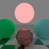

# Task09: Path Tracing (Monte Carlo integration, Importance sampling)

**Deadline: July. 3rd (Fri) at 15:00pm**

This is the blurred preview of the expected result:



----

## Before doing the assignment

Follow the instruction same as `task01` and `task02` to submit the assignment. In a nutshell, before doing the assignment,
- make sure you synchronized the main  branch of your local repository to that of remote repository.
- make sure you created branch `task08` from main branch.
- make sure you are currently in the `task08` branch (use git branch -a command).

The command will be like below

```bash
$ cd acg-<username>  # go to the local repository
$ git checkout main  # set main branch as the current branch
$ git fetch origin main    # download the main branch from remote repository
$ git reset --hard origin/main  # reset the local main branch same as remote repository
$ git branch -a   # make sure you are in main branch
$ git branch task08   # create task08 branch from main branch
$ git checkout task08  # switch into the task08 branch
$ git branch -a   # make sure you are in the task08 branch
```

Now you are ready to go!


Compile the code with

``` bash
$ cd task08  # you are in "acg-<username>/task08" directory
$ cargo run --release # configure Release mode for fast execution
```

This program output `output1.png`, `output2.png`, `output3.png` and `output4.png`.


The `output1.png` is just not physically correct as pixel value is equal to albedo when it hit non-emission surface.
Such image is convenient for scene configuration sanity-check.

### Problem 1 (Analytical Radiance Integration)

The `output2.png` render analytical integration of *direct* light at the shading point, ignoring occlusion. 
Currently, it ignores the radiance from sky.
Add a one line code to the function `radiance_at_hit_point_ver2` to evaluate integration of radiance from sky.  


### Problem 2 (Cosine Importance Sampling)


Initially, the `radiance_at_hit_point_ver3` function samples incoming radiance at the hit-point *uniformly* on a hemisphere.
The image `output3.png` has a lot of noise (i.e., variance is high). 
Especially, you see a few sparse bright pixels (i.e., fireflies) below the green and blue spheres.
Write reason why such bright pixels appears. 

| Reason for fireflies |
|----------------------|
| ????                 |

Change the code inside the function `radiance_at_hit_point_ver3`.


This image employs antialiasing by sampling uniformly inside a pixel.
Inside the table below, put 300x300 magnified images showing around the horizon below red light, without and with antialiasing. 

| w/o antialiasing    | w/antialiasing      |
|---------------------|---------------------|
|  |  |

Observe fictitious low frequency checkerboard pattern in the image without antialiasing.


### Problem 3 (Russian Roulette Algorithm)

Change the code inside the function `throughput_and_light_radiance_at_hit_point`.
Also change the sampling to cosine-weighted sampling. 

Fill in the table below comparing the computation time.

| w/o Russian Roulette | w/ Russian Roulette (sec) |
|----------------------|---------------------------|
| ???                  | ???                       |

notice slight increase of valiance 


### Submit

Before submitting a pull request, neat up the code by fixing the problem pointed out by linter.
```bash
cargo clippy
```

Make your code formated by the following command

```bash
cargo fmt
```

Finally, you submit the document by pushing to the `task08` branch of the remote repository. 

```bash
cd acg-<username>    # go to the top of the repository
git status  # check the changes
git add .   # stage the changes
git status  # check the staged changes
git commit -m "task08 finished"   # the comment can be anything
git push --set-upstream origin task08 # up date the task08 branch of the remote repository
```

got to the GitHub webpage `https://github.com/ACG-2026S/acg-<username>`. If everything looks good on this page, make a pull request. 


