# Task09: Laplacian Mesh Deformation (Quadratic Programming, Sparse Matrix)

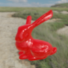

**Deadline: July 17th (Thu) at 15:00pm**

----

## Before Doing Assignment

### Install Python (if necessary)
We use Python for this assignment. 
This assignment only supports Python ver. 3.

To check if Python 3.x is installed, launch a command prompt and type `python3 --version` and see the version.

For MacOS and Ubuntu you have Python installed by default. 
For Windows, you may need to install the Python by yourself.
[This document](https://docs.python.org/3/using/windows.html) show how to install Python 3.x on Windows.


### Virtual environment

We want to install dependency ***locally*** for this assignment.

```bash
cd acg-<username> 
python3 -m venv venv  # make a virtual environment named "venv"
```

Then, start the virtual environment.
For Mac or Linux, type

```bash
source venv/bin/activate  # start virtual environment 
```

For Windows, type  

```bash
venv\Scripts\activate.bat  # start virtual environment
```

In the command prompt, you will see `(venv)` at the beginning of each line.
There will be `venv` folder under `acg-<username>`.
You can exit the virtual environment by typing `deactivate` in the command prompt.


### Install dependency

In this assignment we use many external library. We use `pip` to install these.

```bash
pip3 install numpy
pip3 install scipy
pip3 install polyscope 
```

Alternatively, you can install above dependency at once by

```bash
cd acg-<username>/task09
pip3 install -r requirements.txt
```

type `pip3 list` and then confirm you have libraries such as `scipy`, `numpy`, and `polyscope`.

### Make branch

Follow [this document](../doc/submit.md) to submit the assignment, In a nutshell, before doing the assignment,  
- make sure you synchronized the `main ` branch of your local repository  to that of remote repository.
- make sure you created branch `task09` from `main` branch.
- make sure you are currently in the `task09` branch (use `git branch -a` command).

Now you are ready to go!

---

## Problem 1 (Python execution practice)

Run the code with

```bash
$ cd acg-<username>/task09  # go to the local repository
$ python3 main.py
```

Explain the line #23-#33 by drawing diagram on the note, take photo, and paste the image below. 


Take a screenshot image by selecting the menu of `polyscope`. 
Rename it to `problem1.png` then it replaces the image below. 


This code only move the position of fixed vertex. 
Let's deform other vertices to make the deformation smooth!


## Problem 2 (smooth deformation with Laplacian)

Write a few lines of code around line #47 to implement smooth mesh deformation using Laplacian. 

Take a screenshot image. 
Rename it to `problem2.png` then it replaces the image below.


 

## Problem 3 (even smoother deformation with Bi-Laplacian)

Write a few lines of code around line #80 to implement smooth mesh deformation using BiLaplacian.

run the code with 
```bash
$ cd acg-<username>/task09  # go to the local repository
$ python3 main.py --bilaplacian
```

Take a screenshot image. Rename it to `problem3.png` then it replaces the image below.


## Problem 4: Blender rendering

In the previous step, you animate a mesh of a bunny using `polyscope`. 
When you close the `polyscope` window, then you will see `acg-<username>/tas09/task09/bunny_def.obj`.
Let's visualize the mesh nicely using Blender.

### Launch Blender
  - Launch Blender. 
  - You will see a default cube in the `3D viewport` window. Remove it by `x` key or right click menu `Delete`.
  - Save the project somewhere **outside** the repository.  
  - See the image below for the name of the windows in Blender. 

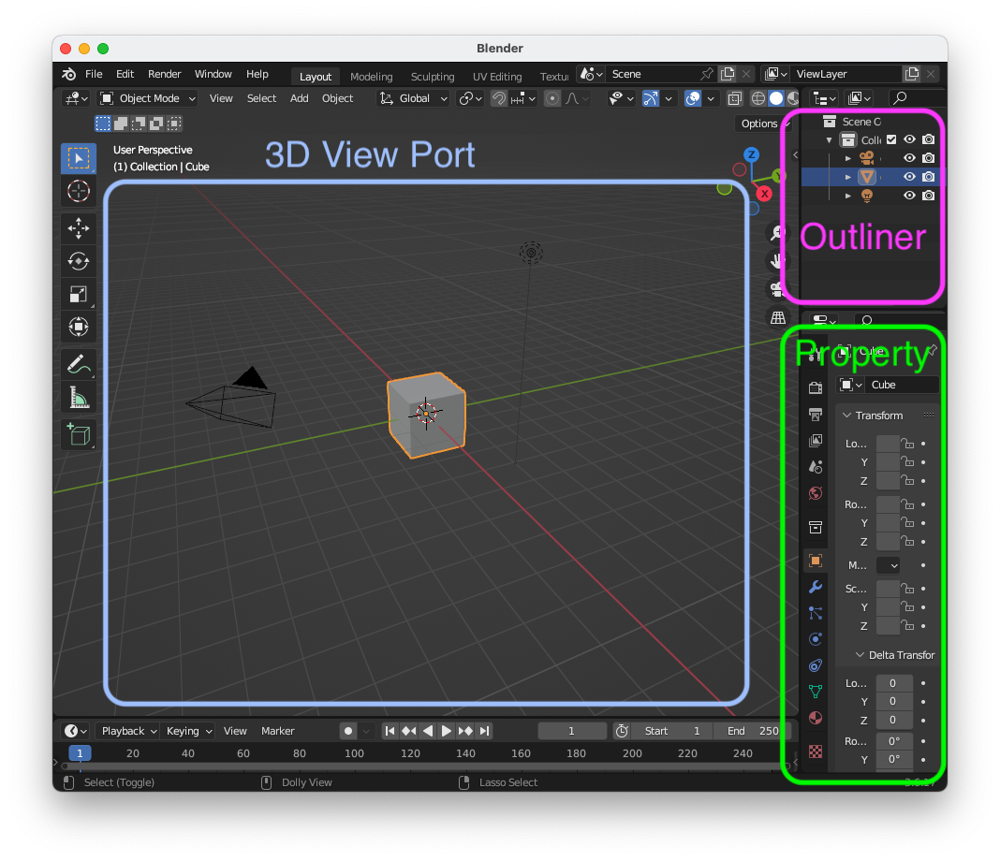

### Model Import
  
  - In Blender, import the `acg-<username>/tas09/task09/bunny_def.obj` by selecting the menu `File > Import > Wavefront (.obj)`.   
  - Make sure the `bunny_def.obj` is successfully imported and shown in the `3D Viewport` window.

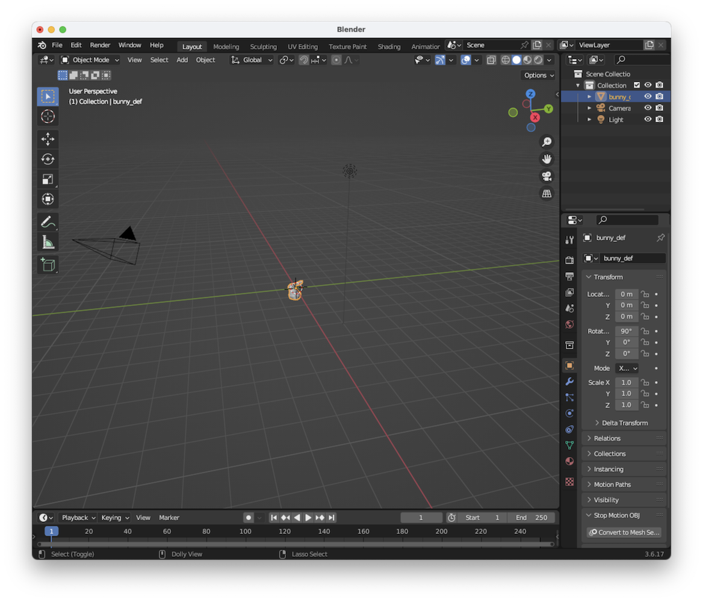

### Camera Setting
  - Select `Camera` in the `Outliner` window.    
  - Select `Object` tab in the `Property` window. 
  - Set the camera transform as Location: `(X:0m, Y: -2m, Z: 0.5m)`, Rotation: `(X:75deg, Y: 0deg, Z: 0deg)`, Mode `XYZ Euler`, Scale: `(1.0, 1.0, 1.0)`.
  - Press `F12` key to see the rendered result, making sure the `bunny_def.obj` is rendered around the center of the image.

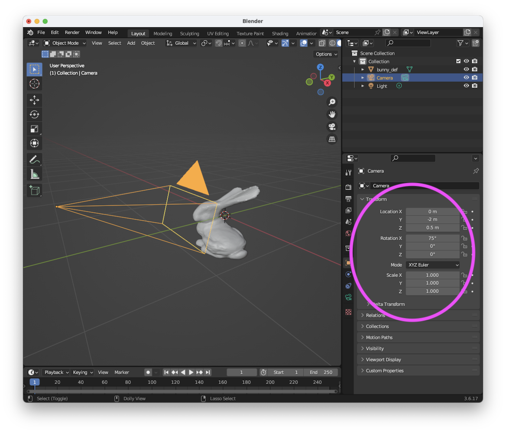

### Output Image Resolution Setting 
  - Select `Output` tab in the `Property` window. 
  - Set the Resolution X as `300 px`, Resolution Y as `300 px`. 
  - Press `F12` key to see the rendered result.

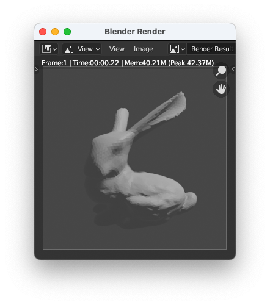
 
### Shader Editor
  - Split the window into two. You can do this by dragging the corner of a window (see [Blender how to split screen and remove split screen @ blenderrian
  ](https://www.youtube.com/watch?v=qp9E_S4iIkE)). 
  - In the right `3D Viewport`window, press the button `Editor type` in the top-left corner, and select the `Shader Editor`.
  - At the top of `Shader Editor` window click a dropdown menu showing `Object`. Change the data from `Object` to `World`. This is necessary to work with environmental textures.

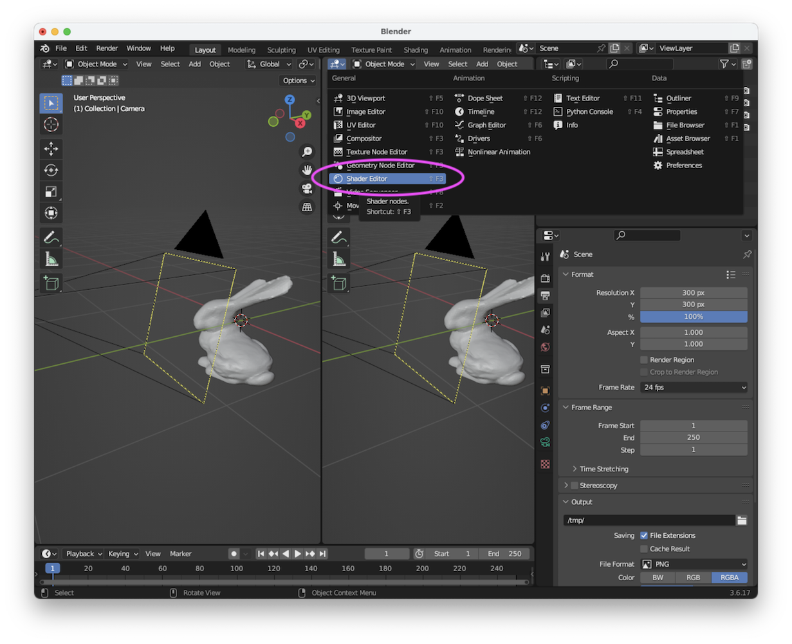

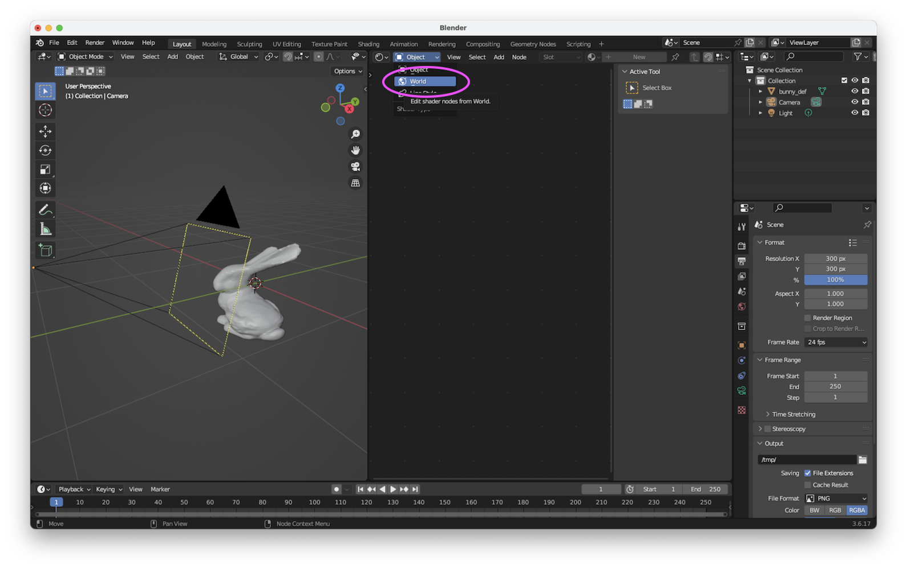

### Environmental Lighting
  - Go to Polyhaven (https://polyhaven.com/hdris), download HDR image such as https://polyhaven.com/a/golden_gate_hills. Download with 1k image with EXR format. Save it somewhere outside the repository.   
  - In the `Shader editor` node, press `Shift + A` to bring up the `Add` menu.
  - Navigate to `Texture` and then choose `Environment Texture`.
  - The `Environment Texture` node is created, but it won't show anything unless you connect it to the shader system.
  - Connect the `Environment Texture` node to the `Background shader` node by clicking and dragging the `output` of the `Environment Texture` node (the yellow dot) to the `input` (the green dot) of the `Background` shader node .
  - In the `Environment Texture` node, click the `Open` button.
  - Select the HDR image you saved on your computer.
  - If the instruction is difficult to follow, watch [The ULTIMATE GUIDE to HDRI Lighting in Blender! @ CG Essentials](https://youtu.be/N3DZL56cG84?si=std5BHYA6Jg7EIjN&t=80).

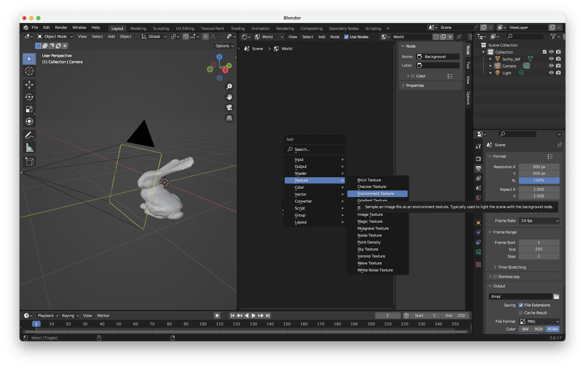

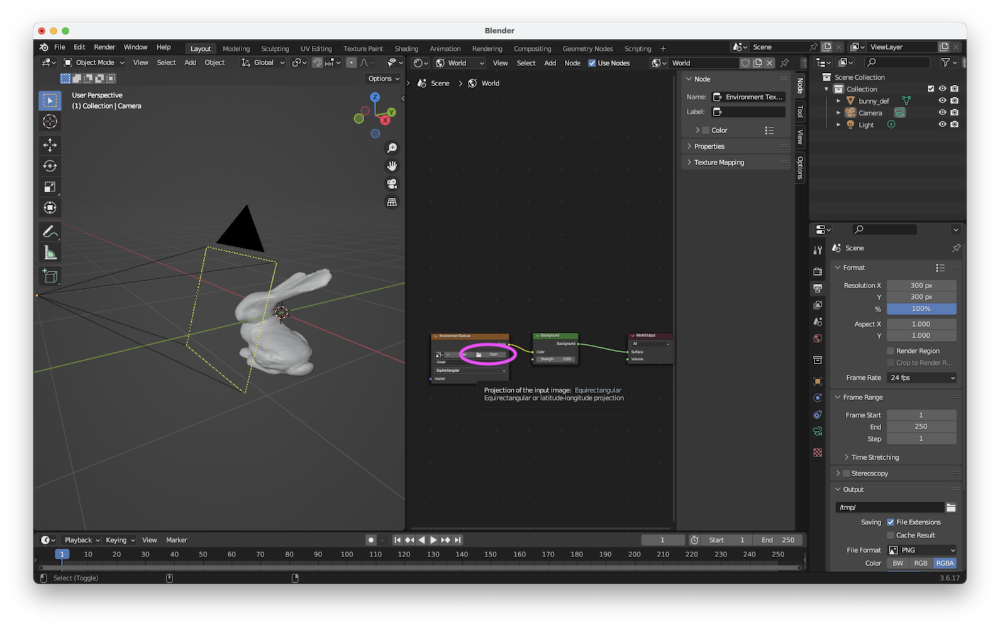

### Set-up Material
  - Select `bunny_def` in the `Outliner` window.
  - Select `Material` tab in the `Property` window 
  - Select `New` in the `Property` window.
  - Set `Base Color` as `(Red: 1.0, Green: 0.0, Blue: 0.0)`, `Metallic` as `0.3`, and `Roughness` around `0.2`.

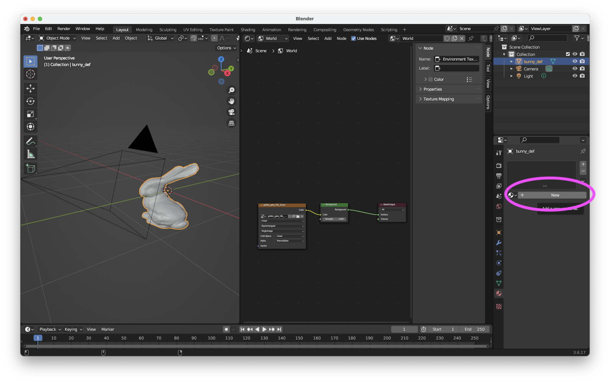

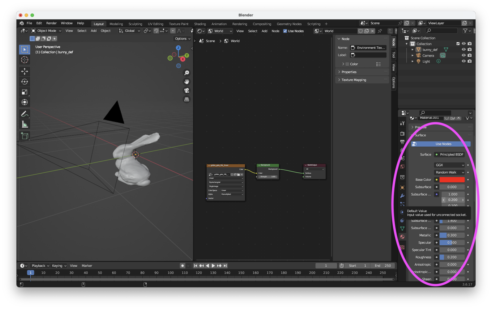

Finally, press `F12` key to see the rendered result. In the `Blender Render` window, save the image as `pba-<username>/task09/problem4.png`. 

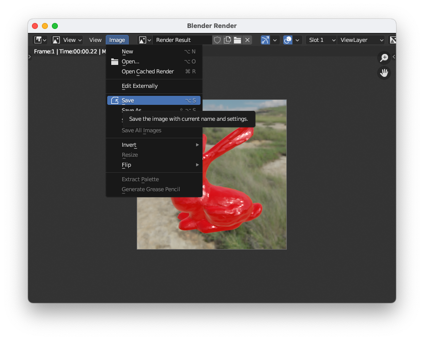

The image needs to be shown below.


## After Doing the Assignment

After modify the code, push the code and submit a pull request. Make sure your pull request only contains the files you edited. Good luck!


